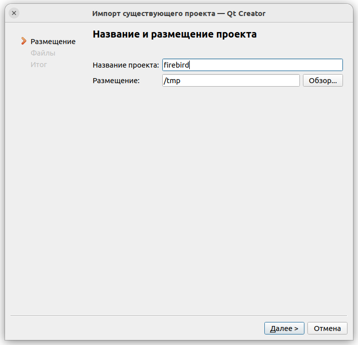

Среды разработки
================

Qt Creator
----------

Импорт проекта
~~~~~~~~~~~~~~

Допустим что проект извлечен в папку ``/tmp/firebird``. Для работы над ним в среде Qt Creator
необходимо выполнить шаги.

Создать проект и выбрать "Импортировать проект, Импорт существующего проекта".

|qt1|

Указать расположение файлов нового проекта. Здесь будут созданы новые файлы проекта самой IDE.
Мы укажем их в каталоге ``/tmp``, который расположен на уровень выше каталога проекта. Это позволит
сохранить файлы, даже при работе с репозиторием.

|qt2|

Однако на следующем шаге необходимо правильно выбрать файлы, входящие в проект.

|qt3|

Если файлы были недавно извлечены, то фильтры можно не применять, а просто выбрать все файлы нашего проекта,
потому что там и так только они. Но если вы уже собирали проект, то в каталоге могут быть временные файлы и каталоги.
В таком случае их можно удалить ``git clean -fdx`` либо применить фильтры, но тогда полезно дописать некоторые расширения файлов, чтобы получилось
``*.epp; *.c; *.cc; *.cpp; *.cp; *.cxx; *.c++; *.h; *.hh; *.hpp; *.hxx;*.conf;`` или другие если вы вдруг их не найдете в дереве файлов проекта при работе.

Добавлять вновь созданные файлы под контроль версий не нужно. Это всегда можно восстановить.

|qt4|

Нажимаем завершить и видим наш проект в среде разработки.

Запуск сервера под отладчиком
~~~~~~~~~~~~~~~~~~~~~~~~~~~~~

.. |qt1| image:: images/ides/qt1.png

.. |qt3| image:: images/ides/qt3.png
.. |qt4| image:: images/ides/qt4.png
